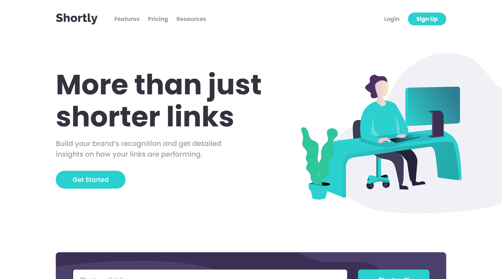

</img>

<h1 align="center">URL Shortener Landing Page</h1>

  <h3>
    <a href="https://dmaotech-url-shortener.netlify.app" color="white">
      Live
    </a>
     | 
    <a href="https://www.frontendmentor.io/solutions/">
      Solution
    </a>
    | 
    <a href="https://www.frontendmentor.io/challenges/url-shortening-api-landing-page-2ce3ob-G">
      Challenge
    </a>
  </h3>

   Solution for a challenge from  <a href="https://www.frontendmentor.io/" target="_blank">frontendmentor.io</a>.

 
 

## About The Project

The main challenge is to build out this URL Shortener landing page and get it looking as close to the design as possible. To get the url shortened, I will be using the Shrtcode API.

 
<b>Users should be able to:</b>
<ul>
<li>View the optimal layout for the site depending on their device's screen size</li>
<li>Shorten any valid URL</li>
<li>See a list of their shortened links, even after refreshing the browser</li>
<li>Copy the shortened link to their clipboard in a single click</li>
<li>Receive an error message when the form is submitted if the input field is empty</li>
</ul>

  
** I do not have access to the Figma sketch so the design is not pixel perfect.

## Built with 

- Semantic HTML5 markup
- CSS custom properties
- Flexbox
- Mobile-first workflow
- JavaScript
- Shrtcode API

## What I learned
I used for the first time the "copy to the clipboard" functionality in a project so i had to learn how it works.

## Useful resources

- <a href="https://www.frontendmentor.io/">Frontend Mentor</a>
- <a href="https://app.shrtco.de/">Shrtcode API</a>

## Social

- Website - [Soon](Soon)
- Frontend Mentor - [@dmaotech](dmaotech)
- Twitter - [Soon](Soon)